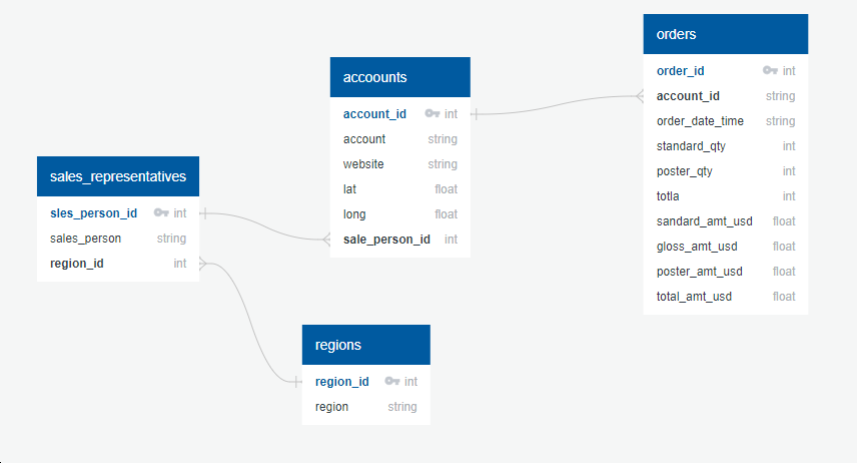

# Querying Parch & Posey Database

## Intro: 
Parch and Posey, a hypothetical paper company's sales data of different types of paper (gloss, standard). 
The database consists of different tables linked with a database schema.

## Data Source:
Modified version of Parch & Posey Database that consists of the tables ; orders, accounts, regions and sales_representatives.

## Objectives:
- To provide answers for adhoc queries/question for the departments of Sales, Marketing, Finance and HR in Parch & Posey.

## Tasks:
In this project, I asnwered the following questions:
__HR Department__
- Provide a table with the region for each sales representative along with their associated accounts. Your final table should include three columns: the region name, the sales rep name, and the account name. Sort the accounts alphabetically (A-Z) according to account name?
- Provide a table with the region for each sales representative along with their associated accounts. This time only for accounts where the sales rep has a first name starting with S and in the Midwest region. Your final table should include three columns: the region name, the sales representative name, and the account name. Sort the accounts alphabetically (A-Z) according to account name?
- Find the number of sales reps in each region. Your final table should have two columns - the region and the number of sales representative. Order from fewest reps to most reps?
- We would like to identify top performing sales reps, which are sales reps associated with more than 200 orders or more than 750000 in total sales. The middle group has any rep with more than 150 orders or 500000 in sales. Create a table with the sales rep name, the total number of orders, total sales across all orders, and a column with top, middle, or low depending on this criteria. Place the top sales people based on dollar amount of sales first in your final table?
- Provide the name of the sales represntative in each region with the largest amount of total_amt_usd sales?

__Finance Department__
- What are the average quantity & average revenue for each paper type (standard, gloss, poster)?
- What is median of (total_amt_usd) values?
- In which month of which year did Walmart spend the most on gloss paper in terms of dollars?
- What is the lifetime average amount spent in terms of total_amt_usd, including only the companies that spent more per order, on average, than the average of all orders?
- What is the lifetime average total amount spent in terms of total_amt_usd for the top 10 total spending accounts?

__Sales and Marketing Departments__
- How many accounts spent more than 30,000 usd total across all orders?
- Provide a table to show the number of orders in each of three categories, based on the total number of items in each order. The three categories are: 'At Least 2000', 'Between 1500 and 2000' and 'Less than 1500'?
- For the region with the largest sales total_amt_usd, how many total orders were placed?
- How many accounts had more total purchases than the account name which has bought the most standard_qty paper throughout their lifetime as a customer?
- Provide a record for the revenue, previous date revenue, difference from the previous date revenue for the top most spending account?

Since I used python environment to do this project, I answered the same questions using pandas to compare between the performance of the two tools. I found that
pandas is easier to write however, SQL is mroe efficient since it does not import the tables from the database into the RAM.